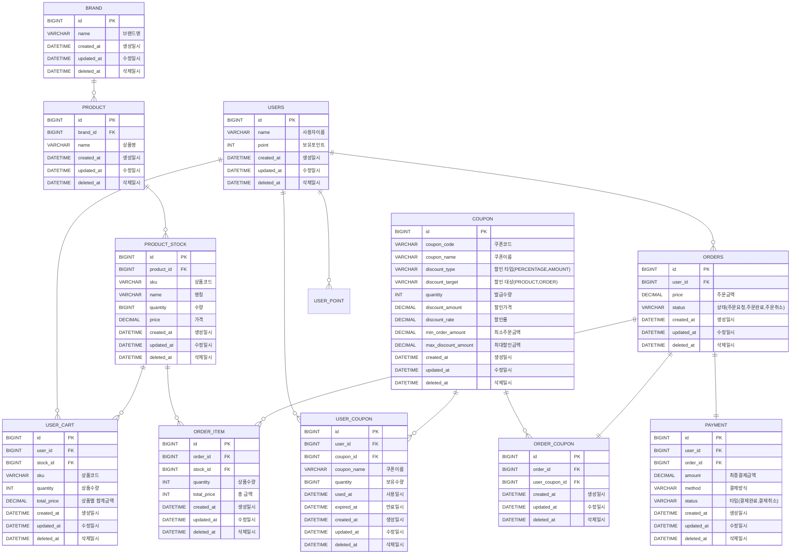

# ERD Diagram

### 연관관계 설명
* USERS와 USER_COUPON: 1:N 관계 (사용자 1명이 여러 개의 쿠폰을 가질 수 있음)
* USERS와 USER_CART: 1:N 관계 (사용자 1명이 여러 개의 장바구니 상품을 가질 수 있음)
* USERS와 ORDERS: 1:N 관계 (사용자 1명이 여러 개의 주문을 가질 수 있음)
* USERS와 USER_COUPON: 1:N 관계 (사용자 1명이 여러 개의 쿠폰을 가질 수 있음)
* BRAND와 PRODUCT: 1:N 관계 (브랜드 1개가 여러 개의 상품을 가질 수 있음)
* PRODUCT와 PRODUCT_STOCK: 1:N 관계 (상품 1개에 여러 재고가 연결될 수 있음, SKU로 구분됨)
* PRODUCT_STOCK와 CART: 1:N 관계 (재고 1개가 여러 장바구니 항목에 포함될 수 있음)
* PRODUCT_STOCK와 ORDER_ITEM: 1:N 관계 (재고 1개가 여러 주문 항목으로 연결될 수 있음)
* COUPON와 USER_COUPON: 1:N 관계 (한 가지의 쿠폰을 여러 사용자가 가질 수 있음)
* COUPON와 ORDER_COUPON: 1:N 관계 (한 가지의 쿠폰이 여러 주문에 적용될 수 있음)
* ORDERS와 ORDER_ITEM: 1:N 관계 (주문 1개가 여러 주문 항목을 포함할 수 있음)
* ORDERS와 ORDER_COUPON: 1:1 관계 (주문 1개에 쿠폰 1개)
* ORDERS와 PAYMENT: 1:1 관계 (주문 1개에 결제 1개)

